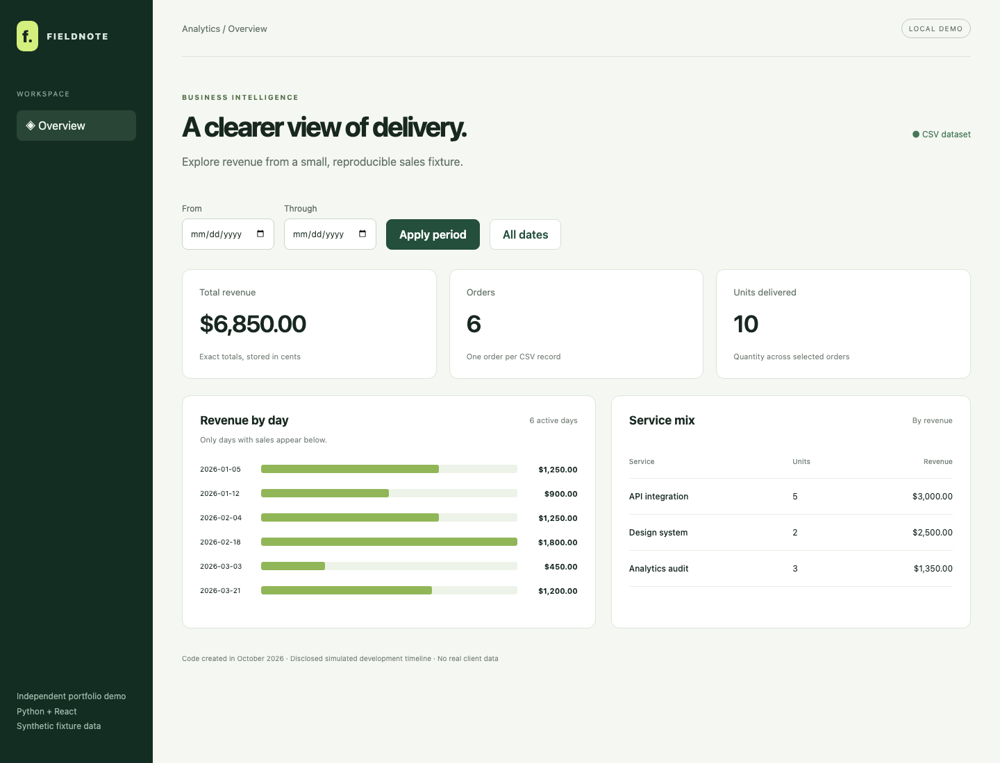

# Python + React analytics demo

A FastAPI service turns a validated CSV fixture into exact revenue metrics. A responsive React dashboard lets you filter dates, inspect daily revenue, and compare the service mix. All sales and amounts are synthetic examples.



## Simulated history

This code was created in **October 2026**. Commit dates are a **simulated development timeline**, not evidence of work performed or employment in those years. This independent, agency-style portfolio demo has no actual client or employer. See [TIMELINE.md](TIMELINE.md).

Python 3.11, FastAPI, React 19.3, Vite 8.3, Rolldown, and the locked dependency versions are modern reconstruction choices; some postdate the illustrative 2024–2026 commits. The January–March 2026 sales fixture is fictional. Historical dates do not describe historical library availability.

## Run locally

Requirements: Python 3.11 and Node.js 24 LTS (minimum 22.12). No credentials or paid services.

From the repository root:

```sh
python3 -m venv .venv
.venv/bin/pip install -r backend/requirements.lock.txt
cd backend
../.venv/bin/python -m uvicorn app.main:create_app --factory --host 127.0.0.1 --port 8101
```

In a second terminal, from the repository root:

```sh
cd frontend
npm ci
npm run dev
```

Open the URL printed by Vite, normally http://127.0.0.1:5173. Its `/api` proxy forwards to port 8101. Both services bind to loopback. API docs: http://127.0.0.1:8101/docs.

## API and data contract

`GET /api/metrics?start=YYYY-MM-DD&end=YYYY-MM-DD` accepts optional inclusive bounds. Invalid dates return 422; inverted bounds return 400. An empty period returns zero metrics and empty breakdowns. Unknown routes return 404.

```json
{"revenue_cents":685000,"orders":6,"units":10,
 "daily":[{"date":"2026-01-05","revenue_cents":125000}],
 "products":[{"product":"API integration","revenue_cents":300000,"units":5}],
 "available_range":{"start":"2026-01-05","end":"2026-03-21"}}
```

The example abbreviates the `daily` and `products` arrays. Currency is USD in integer cents; only display formatting divides by 100. One fixture row represents one order with one service line. `orders` counts rows, not individual delivered units.

`fixtures/sales.csv` requires exactly `order_id,date,product,quantity,unit_price_cents`. IDs must be unique, dates real ISO dates, names nonempty, quantity 1–100,000, and price 0–100,000,000 cents. Negative prices, fractions, malformed records, and empty datasets are rejected at startup. The complete dataset total cannot exceed JavaScript's safe integer range. Edit the fixture and restart to ingest a different dataset; there is no public upload endpoint.

## Architecture and choices

`backend/app/domain.py` validates into immutable sale records and computes metrics without I/O. `main.py` reads the fixture once at application creation, preserving a consistent snapshot for every request. React owns draft filters and request state; an aborted request cannot overwrite a newer period. Failed requests clear the previous metrics, making failures visible. The daily chart has accompanying date and currency text, and the service breakdown is a semantic table.

## Verify

```sh
cd backend
../.venv/bin/python -m pytest -q
cd ../frontend
npm ci
npm run build
```

Verified locally: **20 Python tests**, a production build, and a headless Chromium flow checking full totals, inclusive filters, an empty period, a 390px mobile viewport, network failure recovery, and absence of page errors. The checked screenshot is from the running UI. Fresh verification on October 7, 2026 used Python 3.11 and Node 26. Both suites emitted one upstream Starlette/AnyIO deprecation warning; no tests failed. `backend/requirements.lock.txt` records the exact resolved Python dependency versions; `requirements.txt` lists direct requirements. GitHub Actions reruns the Python suite and production build; a remote CI run is not asserted here.

Try the full fixture ($6,850, 6 orders, 10 units), February 4–18 ($3,050, 2 orders), a 2027 date range (empty), and an inverted range (visible error). Automated tests hand-check aggregation and invalid inputs.

## Limits and security

This is a small immutable single-currency dataset, not an accounting system. It excludes taxes, refunds, multiple line items, time zones, user authentication, and writes. Integer bounds preserve numeric representation; they do not model financial reconciliation. Bind the demo locally. Public deployment needs access control, request limits, dependency review, and infrastructure configuration. React renders names as text. There are no API keys; `.env` and generated data are ignored. Browser smoke checks were local, not a comprehensive accessibility audit or production deployment test.
